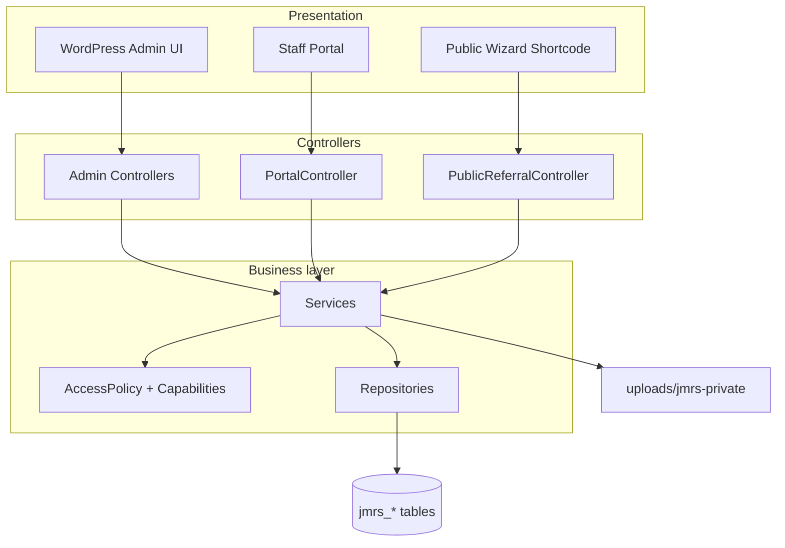
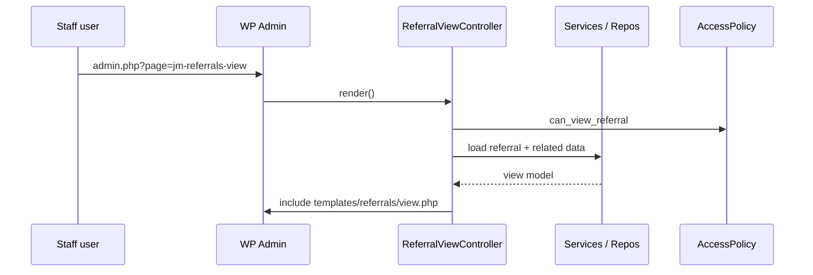
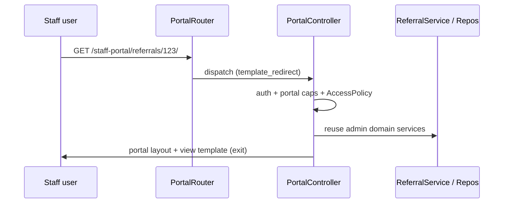
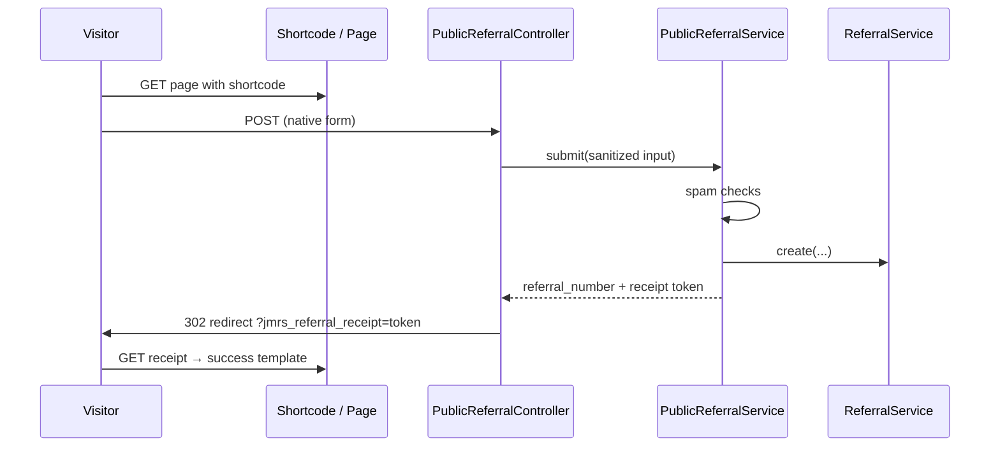
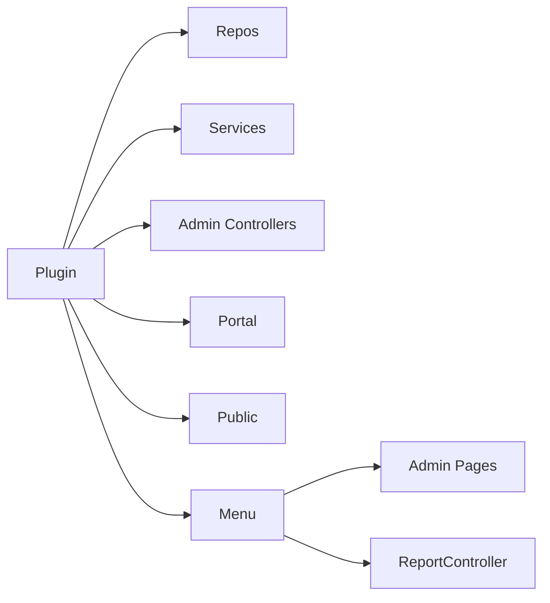

# Architecture — JM Referral System

Developer onboarding guide for the plugin architecture as implemented in **v1.0.0** (schema `2.17.0`).

---

## High-level overview

JM Referral System is a WordPress plugin that manages domiciliary care referrals and related clinical/operational records. It exposes three presentation surfaces that **share one business layer**:

| Surface | Entry | Audience |
| --- | --- | --- |
| WordPress Admin | `admin_menu` → `Menu` + admin controllers | Staff with JM capabilities |
| Staff Portal | Rewrite routes → `PortalRouter` / `PortalController` | Logged-in JM staff (optional) |
| Public Referral Wizard | Shortcode + `template_redirect` POST | Unauthenticated public referrers |

All three call into **Services** → **Repositories** → **MySQL tables** (`{prefix}jmrs_*`). Permissions use WordPress capabilities plus `AccessPolicy` for record scope.

---

## Layered architecture

### Presentation

- **Admin templates:** `templates/` (referrals, dashboard, visits, …) included by controllers after view-model preparation.
- **Portal templates:** `templates/portal/` rendered inside a dedicated layout (theme-independent).
- **Public templates:** `templates/frontend/` rendered by shortcode output buffering.
- **Assets:** `assets/css`, `assets/js` enqueued only on relevant screens (`AdminAssets`, `PortalAssets`, public shortcode).

### Controllers

Translate HTTP (admin-post, admin_init, template_redirect, rewrites) into service calls. Examples:

- `ReferralViewController` — clinical hub in wp-admin
- `PortalController` — read-only portal routes
- `PublicReferralController` — public POST + PRG

Controllers should not contain SQL.

### Services

Own business rules: validation orchestration, activity logging, notifications, permission checks before mutate, enrichment for dashboards. See [`SERVICES.md`](SERVICES.md).

### Repositories

`$wpdb` access only: CRUD, queries, pagination. Column lists and indexes live with table DDL in `Tables.php`.

### Database

Sixteen `{prefix}jmrs_*` tables created via `dbDelta` in `JMReferral\Database\Tables`. Versioned by `Migrator::DB_VERSION` / option `jmrs_db_version`. See [`DATABASE_SCHEMA.md`](DATABASE_SCHEMA.md).

---

## Request flows

### Admin referral view

### Staff portal

### Public wizard submit

---

## Dependency flow

Bootstrap: `jm-referral-system.php` → `Plugin::run()` → `registerReferralControllers()` constructs the graph, then:

- Admin: `Menu` registers pages and builds reports DI locally
- Public: controller + shortcode `register()`
- Portal: `PortalRouter` + `PortalAccess` `register()`

Constructor injection is used throughout. See [`DEPENDENCY_INJECTION.md`](DEPENDENCY_INJECTION.md).

---

## Design decisions

| Decision | Rationale |
| --- | --- |
| Shared services for Admin / Portal / Public | One source of truth for create/access/retention; portal does not fork domain logic |
| Capability + AccessPolicy (not role-name UI gates) | Roles are bundles of caps; Support Worker scoping is policy, not hard-coded role checks in templates |
| Archive-first retention | Soft archive blocks `can_mutate_referral`; permanent delete only when dependents allow |
| Private document storage | New files under `uploads/jmrs-private/`; downloads via controller, not public URLs |
| Product semver ≠ DB version | `JMRS_VERSION` vs `Migrator::DB_VERSION` evolve independently |
| Portal theme independence | `template_redirect` + `exit` avoids theme header/footer wrapping staff data |
| Public PRG + receipt transient | Prevents duplicate POST; shows confirmation without putting PHI in the URL |

---

## Related docs

- [`DATABASE_SCHEMA.md`](DATABASE_SCHEMA.md)
- [`PERMISSIONS.md`](PERMISSIONS.md)
- [`WORKFLOWS.md`](WORKFLOWS.md)
- [`PORTAL_ARCHITECTURE.md`](PORTAL_ARCHITECTURE.md)
- [`PUBLIC_REFERRAL_ARCHITECTURE.md`](PUBLIC_REFERRAL_ARCHITECTURE.md)
- [`SERVICES.md`](SERVICES.md)
- [`DEPENDENCY_INJECTION.md`](DEPENDENCY_INJECTION.md)
- [`PROJECT_HISTORY.md`](PROJECT_HISTORY.md)
