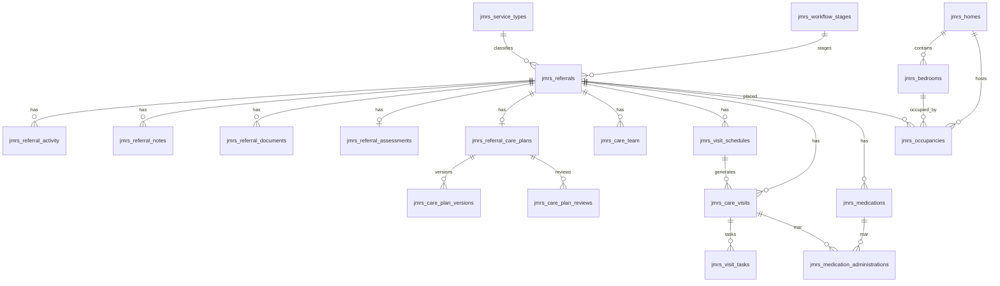

# Database Schema — JM Referral System

Schema version: **`2.21.0`** (`Migrator::DB_VERSION`, option `jmrs_db_version`).
DDL authority: `JMReferral\Database\Tables::create()` via WordPress `dbDelta`.

All physical names are `{wpdb->prefix}jmrs_*`. Methods below are on `Tables`.

---

## Entity relationship (overview)

---

## Tables

### `jmrs_referrals` — `referrals_table()`

**Purpose:** Core referral / client intake record.

| | |
| --- | --- |
| **PK** | `id` |
| **FKs (logical)** | `service_type_id` → service types; `workflow_stage_id` → workflow stages; `assigned_to` / `archived_by` → WP users |

**Major columns:** `referral_number`, client identity/contact/address fields, referrer fields, `priority`, `status`, `assigned_to`, `referral_source`, `care_requirements`, **`care_setting`** (`supported_living` \| `own_home` \| NULL — Phase 2D), `submission_channel`, `public_consent_at`, `public_consent_version`, **archive:** `archived_at`, `archived_by`, `archive_reason`, timestamps.

**Indexes (selected):** `status`, `priority`, `assigned_to`, `service_type_id`, `workflow_stage_id`, `submission_channel`, `archived_at`, `care_setting`, composites `archived_at_status`, `status_priority`, `assigned_to_archived_at`.

**Workflows:** Create (admin/public), edit (incl. care setting), assign, stage change, list/export/filter by care setting, archive/restore, portal view.

---

### `jmrs_referral_activity` — `referral_activity_table()`

**Purpose:** Audit timeline of actions on a referral.

| | |
| --- | --- |
| **PK** | `id` |
| **FK** | `referral_id` → referrals; `user_id` → WP user |

**Columns:** `action`, `description`, `created_at`.
**Indexes:** `referral_id`, `user_id`, `action`, `referral_id_created_at`.

---

### `jmrs_referral_notes` — `referral_notes_table()`

**Purpose:** Internal staff notes.

| | |
| --- | --- |
| **PK** | `id` |
| **FK** | `referral_id`, `user_id` |

**Columns:** `note`, `created_at`.
**Indexes:** `referral_id`, `user_id`, `referral_id_created_at`.

---

### `jmrs_service_types` — `service_types_table()`

**Purpose:** Configurable service catalogue.

| | |
| --- | --- |
| **PK** | `id` |
| **Unique** | `slug` |

**Columns:** `name`, `slug`, `description`, `status`, timestamps.
**Indexes:** `UNIQUE slug`, `status`.

---

### `jmrs_workflow_stages` — `workflow_stages_table()`

**Purpose:** Pathway stages for referrals.

| | |
| --- | --- |
| **PK** | `id` |
| **Unique** | `slug` |

**Columns:** `name`, `slug`, `description`, `stage_order`, `status`, timestamps.
Seeded by migrator when empty.

---

### `jmrs_referral_documents` — `referral_documents_table()`

**Purpose:** Document metadata (files on disk or legacy attachments).

| | |
| --- | --- |
| **PK** | `id` |
| **FK** | `referral_id`; optional `attachment_id` (legacy Media Library) |

**Columns:** `original_name`, `mime_type`, `file_size`, `uploaded_by`, `storage_type`, `relative_path`, `stored_name`, `checksum_sha256`, `created_at`.

**Private storage:** When private, bytes live under `uploads/jmrs-private/` (`PrivateDocumentStorage::DIRECTORY_NAME`). Downloads go through `ReferralDocumentController`, never raw public URLs for new files.

---

### `jmrs_referral_assessments` — `referral_assessments_table()`

**Purpose:** Structured assessment (one per referral).

| | |
| --- | --- |
| **PK** | `id` |
| **Unique** | `referral_id` |

**Columns:** `assessor_user_id`, `assessment_date`, `outcome`, `next_review_date`, domain LONGTEXT/short fields (mobility, personal care, meds, home/safety, summary, etc.).

---

### `jmrs_referral_care_plans` — `referral_care_plans_table()`

**Purpose:** Active care plan (one per referral).

| | |
| --- | --- |
| **PK** | `id` |
| **Unique** | `referral_id` |
| **FK** | `assessment_id`, `created_by`, `approved_by` |

**Columns:** `plan_status`, `start_date`, `review_date`, care content fields (visit frequency/duration, task areas, risks, goals, …).

---

### `jmrs_care_plan_versions` — `care_plan_versions_table()`

**Purpose:** Immutable snapshots when plans change.

| | |
| --- | --- |
| **PK** | `id` |
| **Unique** | `(care_plan_id, version_number)` |

**Columns:** `snapshot` (JSON/text), `created_by`, `change_summary`, `created_at`.

---

### `jmrs_care_plan_reviews` — `care_plan_reviews_table()`

**Purpose:** Formal care-plan review events.

| | |
| --- | --- |
| **PK** | `id` |
| **FK** | `care_plan_id`, `reviewed_by` |

**Columns:** `review_date`, `outcome`, `notes`, `next_review_date`, `created_at`.

---

### `jmrs_care_team` — `care_team_table()`

**Purpose:** Staff assignments to a referral / care plan.

| | |
| --- | --- |
| **PK** | `id` |
| **FK** | `referral_id`, `care_plan_id`, `user_id` |

**Columns:** `team_role`, `is_primary`, `assignment_status`, `start_date`, `end_date`, `notes`.

---

### `jmrs_visit_schedules` — `visit_schedules_table()`

**Purpose:** Recurring/manual schedule definitions.

| | |
| --- | --- |
| **PK** | `id` |
| **FK** | `referral_id`, `care_plan_id`, `team_assignment_id` |

**Columns:** schedule name, repeat type, days, times, window dates, `status`.

---

### `jmrs_care_visits` — `care_visits_table()`

**Purpose:** Individual visits (manual or generated).

| | |
| --- | --- |
| **PK** | `id` |
| **Unique** | `generation_key` (idempotent generation) |
| **FK** | `referral_id`, `care_plan_id`, `schedule_id`, `assigned_user_id`, `reviewed_by` |

**Columns:** `visit_date`, `start_time`, `end_time`, `visit_status`, `visit_type`, execution fields (`arrival_time`, `departure_time`, `visit_outcome`, task summaries, review fields), service-location snapshot fields (Phase 2F.1; nullable; written only at visit execution):

- `service_location_type` (`supported_living` \| `own_home` \| `unresolved`)
- `service_location_label` (denormalized display label)
- `service_address_line_1` / `service_address_line_2` / `service_city` / `service_postcode`
- `service_home_id` / `service_bedroom_id` / `service_occupancy_id` (app references; no DB FK)
- `service_location_recorded_at`

Unexecuted / generated visits leave these NULL. No backfill for legacy executed rows.

---

### `jmrs_visit_tasks` — `visit_tasks_table()`

**Purpose:** Per-visit care tasks (often generated from care plan).

| | |
| --- | --- |
| **PK** | `id` |
| **FK** | `visit_id` |

**Columns:** `task_name`, `task_status`, `task_notes`, `display_order`.

---

### `jmrs_medications` — `medications_table()`

**Purpose:** Medication list for a referral.

| | |
| --- | --- |
| **PK** | `id` |
| **FK** | `referral_id` |

**Columns:** `medication_name`, `strength`, `dosage`, `route`, `frequency`, `instructions`, `start_date`, `end_date`, `medication_status`, `prescribing_source`.

---

### `jmrs_medication_administrations` — `medication_administrations_table()`

**Purpose:** MAR rows for a visit.

| | |
| --- | --- |
| **PK** | `id` |
| **Unique** | `(medication_id, visit_id, scheduled_time)` |
| **FK** | `medication_id`, `visit_id`, witness/admin user fields as stored |

**Columns:** administration status, dose given, reason codes, notes, times.

---

### `jmrs_homes` — `homes_table()`

**Purpose:** Supported living property records (Phase 2B). No referral/client FK.

| | |
| --- | --- |
| **PK** | `id` |
| **Indexes** | `status`, `manager_user_id`, `name` |
| **App FK** | `manager_user_id` → WP user (no DB constraint) |

**Status values:** `active`, `inactive` (soft archive; no hard-delete in Staff Portal).

**Columns:** name, address_line_1/2, city, postcode, phone, manager_user_id, status, notes, timestamps.

### `jmrs_bedrooms` — `bedrooms_table()`

**Purpose:** Rooms within a home. Capacity = count of **active** bedrooms.

| | |
| --- | --- |
| **PK** | `id` |
| **Unique** | `(home_id, room_label)` |
| **Indexes** | `home_id`, `status`, `(home_id, status)` |
| **App FK** | `home_id` → `jmrs_homes.id` (no DB constraint) |

**Do not store** `referral_id` / `client_id` on bedrooms. Occupancy is Phase 2C (`jmrs_occupancies`).

**Status values:** `active`, `inactive`. New bedrooms cannot be created under an inactive home. Occupied bedrooms cannot be inactivated.

### `jmrs_occupancies` — `occupancies_table()`

**Purpose:** Historical Supported Living placements (one active per bedroom; one active per referral).

| | |
| --- | --- |
| **PK** | `id` |
| **Indexes** | `(referral_id, status)`, `(bedroom_id, status)`, `(home_id, status)`, `move_in_date`, `status` |
| **App FKs** | `referral_id`, `home_id`, `bedroom_id`, `created_by`, `ended_by` (no DB constraints) |

**Status values:** `active`, `ended`.

**Columns:** move_in_date, move_out_date, notes, end_reason, created_by, ended_by, created_at, updated_at, ended_at.

Active uniqueness is enforced in `OccupancyService` with transactions + `SELECT … FOR UPDATE` (not a partial unique index).

---

## Archive fields

On `jmrs_referrals`:

- `archived_at` — soft archive timestamp (empty/null = active)
- `archived_by` — user ID
- `archive_reason` — free text

`AccessPolicy::can_mutate_referral()` returns false when archived. List/dashboard defaults exclude archived unless filter scope says otherwise. Permanent delete is separate (`ReferralRetentionService`) and blocked when dependents exist.

---

## Private document storage

| Concern | Implementation |
| --- | --- |
| Directory | `wp-content/uploads/jmrs-private/` |
| Class | `PrivateDocumentStorage` |
| DB link | `storage_type`, `relative_path`, `stored_name`, `checksum_sha256` |
| Legacy | `attachment_id` + Media Library file until migrated |
| Serving | `ReferralDocumentController::handle_download` |

---

## Migration notes

- `Migrator::maybe_migrate()` on `plugins_loaded` and activation.
- Indexes/columns for current version are applied by re-running `Tables::create()` (`dbDelta`).
- Legacy table rename: `{prefix}jm_referrals` → `jmrs_referrals` when needed.
