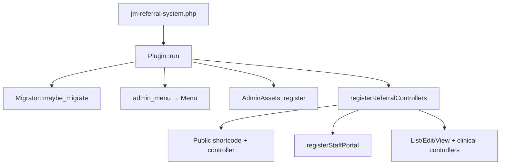
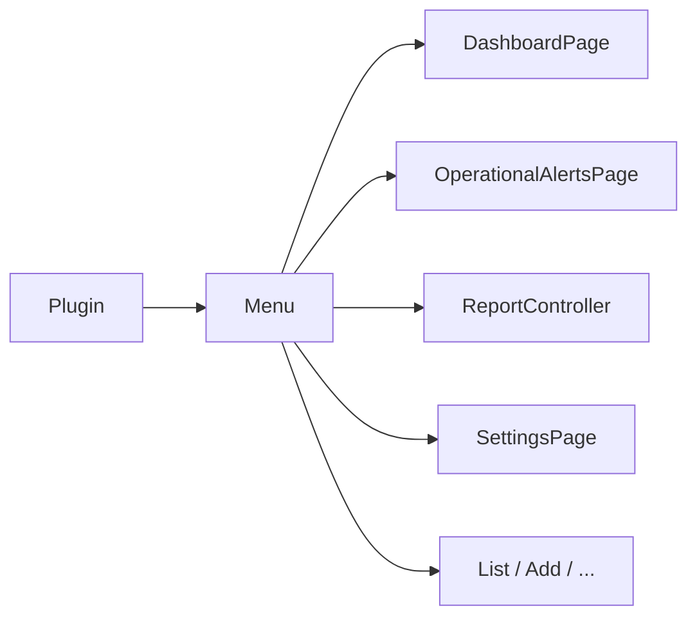
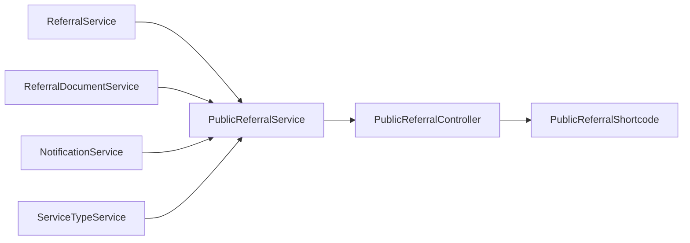
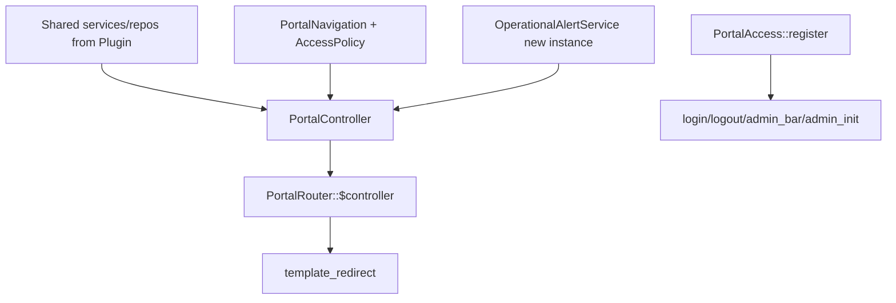

# Dependency Injection — JM Referral System

Composition root: `JMReferral\Core\Plugin` (`registerReferralControllers()`), plus additional construction inside `JMReferral\Admin\Menu` for reports/dashboard wiring.

There is **no** PSR-11 container — dependencies are constructed manually and passed via constructors.

---

## Why constructor injection

- Explicit dependencies (easy to see what a class needs)
- Testability / substitution without globals
- Avoids service-locator anti-pattern inside domain classes
- Matches Repository → Service → Controller layering

Static helpers remain for pure utilities (`Capabilities`, `PortalSettings`, `UiHelper`, URL builders).

---

## Bootstrap



---

## Construction order (Plugin)

Approximate order inside `registerReferralControllers()`:

1. **Foundation:** `ReferralRepository`, `ReferralNumberGenerator`, activity repo/service, `AccessPolicy`, notes, `UserProvider`, `ReferralFilters`
2. **Documents:** document repo, `PrivateDocumentStorage`, `ReferralDocumentService`
3. **Assessment / care plan:** assessment service; care plan review service; care plan service
4. **Team / schedule:** `CareTeamService`, `ScheduleService`
5. **Visits / meds:** visit repo, `VisitTaskService`, medication + MAR services, `CareVisitService`, `VisitExecutionService`, `ScheduleGenerationService`
6. **Catalogue:** service type + workflow stage services/controllers
7. **Notifications + ReferralService**
8. **Public referral:** `PublicReferralService` → controller → shortcode → `register()`
9. **Retention** then **`registerStaffPortal(...)`**
10. **Admin referral controllers** (list/edit/view) and clinical controllers → `register()` hooks

Portal builds its own `OperationalAlertService` instance and a `PortalController` with the shared clinical graph, then:

```php
PortalRouter::set_controller($controller);
PortalRouter::register();
PortalAccess::register();
```

---

## Menu / Admin pages

`Plugin::registerAdminMenu()` passes already-built controllers/services into `Menu`.

`Menu` additionally constructs (among other page objects):

- `DashboardPage` (needs visits, alerts, meds, reports, …)
- `OperationalAlertService` + `ReportService` + report controllers (**second** alert service instance vs portal/plugin)
- `SettingsPage` with document service + dependency repository



---

## Public wizard wiring



---

## Portal wiring



---

## Settings

Imperative options (not WP Settings API registration for these):

- Public: `PublicReferralSettings`
- Portal: `PortalSettings`

Saved from `SettingsPage` POST handlers with nonces.

---

## Activation

`Activator`: migrate, grant admin caps, register roles, ensure private storage, `PortalRouter::flush_rules()`.  
`Deactivator`: `flush_rewrite_rules` (settings preserved).

---

## Related

- [`SERVICES.md`](SERVICES.md)
- [`ARCHITECTURE.md`](ARCHITECTURE.md)
- Known limitation: Menu DI duplication vs Plugin graph
