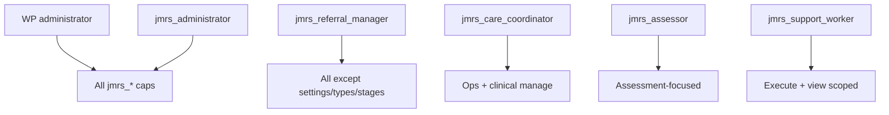

# Permissions — JM Referral System

Source: `JMReferral\Permissions\Capabilities`, `Roles`, `AccessPolicy`.

---

## Why capabilities over role-name checks

Roles are **bundles of capabilities**. UI and services should call `Capabilities::current_user_can( … )` (or `user_can`) so:

- Custom capability grants still work without a JM role slug
- Portal navigation stays capability-driven
- WordPress Administrators receive all JMRS caps via `Capabilities::grant_to_administrators()`

Role slugs are still used for:

- Registering default cap sets (`Roles::register()`)
- AccessPolicy “unrestricted” staff detection (alongside `manage_options`)
- Portal “role label” display and optional wp-admin redirect eligibility

---

## Capabilities (complete list)

| Constant | Cap string |
| --- | --- |
| `VIEW_DASHBOARD` | `jmrs_view_dashboard` |
| `VIEW_REFERRALS` | `jmrs_view_referrals` |
| `CREATE_REFERRALS` | `jmrs_create_referrals` |
| `EDIT_REFERRALS` | `jmrs_edit_referrals` |
| `DELETE_REFERRALS` | `jmrs_delete_referrals` |
| `ARCHIVE_REFERRALS` | `jmrs_archive_referrals` |
| `RESTORE_REFERRALS` | `jmrs_restore_referrals` |
| `ASSIGN_REFERRALS` | `jmrs_assign_referrals` |
| `ADD_NOTES` | `jmrs_add_notes` |
| `EXPORT_REFERRALS` | `jmrs_export_referrals` |
| `UPLOAD_DOCUMENTS` | `jmrs_upload_documents` |
| `DOWNLOAD_DOCUMENTS` | `jmrs_download_documents` |
| `VIEW_CARE_PLANS` | `jmrs_view_care_plans` |
| `MANAGE_CARE_PLANS` | `jmrs_manage_care_plans` |
| `REVIEW_CARE_PLANS` | `jmrs_review_care_plans` |
| `VIEW_VISITS` | `jmrs_view_visits` |
| `MANAGE_VISITS` | `jmrs_manage_visits` |
| `EXECUTE_VISITS` | `jmrs_execute_visits` |
| `VIEW_CARE_TEAM` | `jmrs_view_care_team` |
| `MANAGE_CARE_TEAM` | `jmrs_manage_care_team` |
| `VIEW_SCHEDULES` | `jmrs_view_schedules` |
| `MANAGE_SCHEDULES` | `jmrs_manage_schedules` |
| `MANAGE_SERVICE_TYPES` | `jmrs_manage_service_types` |
| `MANAGE_WORKFLOW_STAGES` | `jmrs_manage_workflow_stages` |
| `MANAGE_SETTINGS` | `jmrs_manage_settings` |
| `VIEW_OPERATIONAL_ALERTS` | `jmrs_view_operational_alerts` |
| `VIEW_REPORTS` | `jmrs_view_reports` |
| `VIEW_MEDICATIONS` | `jmrs_view_medications` |
| `MANAGE_MEDICATIONS` | `jmrs_manage_medications` |
| `ADMINISTER_MEDICATIONS` | `jmrs_administer_medications` |
| `VIEW_HOMES` | `jmrs_view_homes` |
| `MANAGE_HOMES` | `jmrs_manage_homes` |
| `MANAGE_OCCUPANCIES` | `jmrs_manage_occupancies` |
| `OVERRIDE_PIPELINE_STAGE` | `jmrs_override_pipeline_stage` |

Helpers: `Capabilities::all()`, `grant_to_administrators()`, `revoke_from_administrators()`, `current_user_can()`.

---

## Roles

Custom roles always include WordPress `read`.

### `jmrs_administrator` — JM Administrator

All JMRS capabilities.

### `jmrs_referral_manager` — Referral Manager

All except: `manage_service_types`, `manage_workflow_stages`, `manage_settings`. Includes supported living view + manage homes + manage occupancies, and **`override_pipeline_stage`**. May **Express Interest**.

### `jmrs_care_coordinator` — Care Coordinator

Dashboard, view/create/edit/assign referrals, notes, documents, care plans (view/manage/review), visits (view/manage/execute), care team, schedules, alerts, reports, medications (view/manage/administer), supported living homes (view/manage), occupancies (manage).

**May Express Interest** (commercial interest response) via `AccessPolicy::can_express_interest`. **May prepare/send Package Cost** via `can_manage_package_cost`. **May record Local Authority Decision** via `can_record_la_decision`. **May Mark as Not Proceeding** via `can_mark_not_proceeding`. **May Confirm Care Commenced** via `can_commence_care`. **May schedule/reschedule assessments** via `can_schedule_assessment`.

**No** delete, archive, restore, export, settings, service types, workflow stages, **pipeline override**.

### `jmrs_assessor` — Assessor

View/edit referrals, notes, docs, care plans (view/manage/review), view visits/team/schedules, view/manage medications, **view** supported living homes.

**May schedule/reschedule assessments** (legitimate business actions; does **not** gain `override_pipeline_stage`).

**No** dashboard, create, delete, archive, assign, export, execute visits, manage team/schedules, alerts, reports, administer meds, manage homes/occupancies, settings, **pipeline override**, **Express Interest**, **Package Cost prepare/send**, **Local Authority Decision**, **Mark as Not Proceeding**, **Confirm Care Commenced**.

### `jmrs_support_worker` — Support Worker

Dashboard, view referrals, notes, download docs, view care plans/visits/team/schedules/meds, execute visits, administer medications.

**No** estate-wide home or occupancy capabilities. **No** pipeline override. **No** Express Interest. **No** Package Cost. **No** Local Authority Decision. **No** Mark as Not Proceeding. **No** Confirm Care Commenced. **No** assessment scheduling.

**Scoped** by AccessPolicy to assigned referrals.

### WordPress `administrator`

Receives all JMRS caps via `grant_to_administrators()` (activation / migrator paths).

---

## AccessPolicy

Class: `JMReferral\Permissions\AccessPolicy`.

| Method | Rule |
| --- | --- |
| `can_view_referral` | Requires `VIEW_REFERRALS`; if scoped, `assigned_to` must equal current user |
| `can_edit_referral` | Requires `EDIT_REFERRALS`; same scope rule |
| `is_referral_archived` | Non-empty `archived_at` |
| `can_mutate_referral` | False if archived; else `can_edit_referral` |
| `can_express_interest` | Requires mutate access **and** role is JM Administrator, Referral Manager, Care Coordinator, or WP admin. Assessor / Support Worker denied. Does **not** require `override_pipeline_stage`. |
| `can_manage_package_cost` | Same commercial gate as `can_express_interest` (Admin / Manager / Coordinator / WP admin). Assessor / Support Worker denied. Does **not** require `override_pipeline_stage`. Covers prepare, automated Package Cost email, and Secure Portal/Other record-submit. |
| `can_record_la_decision` | Same commercial gate as `can_express_interest`. Covers recording Approved / Declined / Not Proceeding. Does **not** require `override_pipeline_stage`. |
| `can_mark_not_proceeding` | Same commercial gate. Generic Mark as Not Proceeding on allowed active stages (not `awaiting_la_decision`). Does **not** require `override_pipeline_stage`. |
| `can_commence_care` | Same commercial gate. Confirm Care Commenced on `transition_planning` when hard prerequisites are met. Does **not** require `override_pipeline_stage` or `jmrs_manage_occupancies`. |

### Pipeline Dashboard (Phase 3H)

| Surface | Who |
| --- | --- |
| Referral Pipeline / Needs Attention / Active Pipeline Queue | JM Administrator, Referral Manager, Care Coordinator (unrestricted `VIEW_DASHBOARD` + `VIEW_REFERRALS`) |
| Support Worker dashboard | Scoped care KPIs only — **no** acquisition pipeline commercial surface |
| Assessor | No `VIEW_DASHBOARD` |

Internal targets are configured under Settings → **Pipeline Internal Targets** (`jmrs_manage_settings`). Operational targets only — not contractual SLAs.
| `can_schedule_assessment` | Same as `can_mutate_referral` (EDIT_REFERRALS + not archived + scope). Assessor allowed. Support Worker denied (no EDIT). Does **not** require `override_pipeline_stage`. |
| `should_scope_to_assigned` | True for `jmrs_support_worker` without unrestricted access |
| `get_assigned_user_constraint` | User ID when scoped; else `null` (used by list/dashboard queries) |

**Unrestricted referral access** (not Support-Worker-scoped): `manage_options`, WP `administrator` role, or JM roles administrator / referral_manager / care_coordinator / assessor.

---

## Mutation rules

Clinical/operational writes (notes, documents, assessment save, care plan save, visits, meds, schedules, team) typically require:

1. Relevant capability  
2. `AccessPolicy::can_mutate_referral()` (or edit/view as appropriate)  
3. Nonces / `check_admin_referer` on admin actions  

Archived referrals: mutations blocked; restore/archive flows use dedicated caps.

---

## Archive rules

| Action | Cap | Notes |
| --- | --- | --- |
| Archive | `ARCHIVE_REFERRALS` | Soft retention fields set |
| Restore | `RESTORE_REFERRALS` | Clears archive fields |
| Permanent delete | `DELETE_REFERRALS` | Only when dependency summary allows (`ReferralRetentionService`) |

Default list/dashboard scope: **active** (non-archived).

---

## Document download rules

- Cap: `DOWNLOAD_DOCUMENTS`
- AccessPolicy view on the parent referral
- URL from `ReferralDocumentController::get_download_url()` (admin handler + nonce)
- Portal reuse same URLs; `PortalAccess` allowlists download query args when wp-admin redirect is on

Upload: `UPLOAD_DOCUMENTS` + mutate (admin); public uploads use `ReferralDocumentService::upload_for_public_intake` when settings allow (no staff login).

---

## Portal permissions

**Entry** (`PortalAccess::portal_entry_capabilities`): any of view dashboard, referrals, visits, care plans, reports, operational alerts, medications, care team, schedules — or `manage_options`.

**Routes:**

- Dashboard → `VIEW_DASHBOARD`
- List/view referrals → `VIEW_REFERRALS` + AccessPolicy on records
- Section widgets → same caps as admin dashboard pieces

**Missing/inaccessible referral:** generic portal 404 (no existence leak).

---

## Public permissions

Unauthenticated. Gate is settings `enabled` + spam/nonce validation — **not** JMRS capabilities. Created referrals use admin create path with `submission_channel = public_website`.

---

## Related

- [`ARCHITECTURE.md`](ARCHITECTURE.md)
- [`WORKFLOWS.md`](WORKFLOWS.md)
- Ops guides: `docs/ADMINISTRATOR_GUIDE.md`, `docs/STAFF_PORTAL.md`
