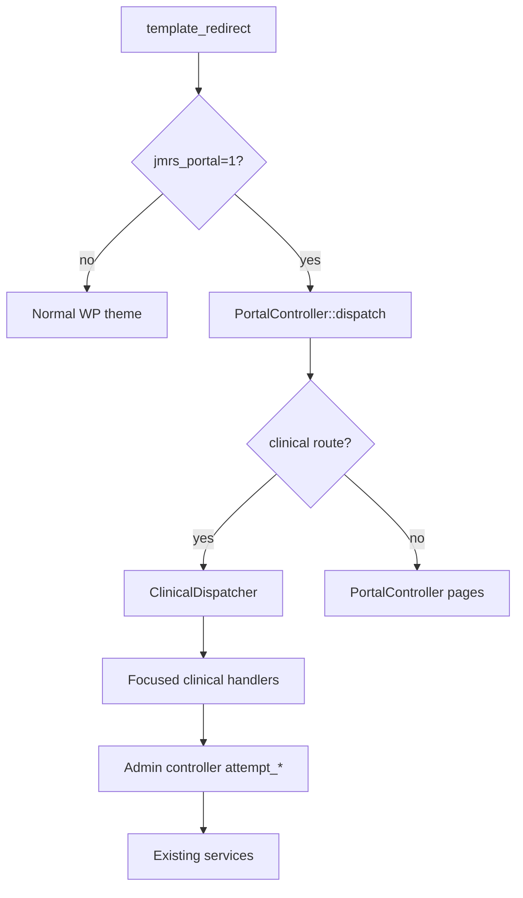

# Portal Architecture — JM Referral System

Staff frontend portal. Namespace: `JMReferral\Portal` (+ `JMReferral\Portal\Clinical`).

**Default base path:** `staff-portal`  
**Rewrite version constant:** `PortalRouter::REWRITE_VERSION` (`1.1.2`)  
**Disabled by default** (`PortalSettings`).

---

## Components

| Class | Responsibility |
| --- | --- |
| `PortalSettings` | Option `jmrs_staff_portal_settings`; sanitize; flush rewrites on enable/path change |
| `PortalUrls` | Portal URL helpers (referral, clinical routes) |
| `PortalRouter` | Rewrite rules, query vars (`jmrs_portal_entity`), `template_redirect` dispatch |
| `PortalController` | Auth gates, dashboard/list/view/edit/assessment/care-plan; implements `PortalViewHost` |
| `PortalRetentionHandler` | Archive/restore POST → `ReferralRetentionService` |
| `ClinicalDispatcher` | Routes clinical portal actions to focused handlers |
| `ClinicalAccess` | Shared referral gates + breadcrumbs for clinical handlers |
| Handlers | `CarePlanReviewHandler`, `MedicationHandler`, `CareTeamHandler`, `ScheduleHandler`, `VisitHandler` |
| `PortalAccess` / `PortalNavigation` / `PortalAssets` | Eligibility, nav, CSS/JS |

---

## Routing

Query vars: `jmrs_portal`, `jmrs_portal_route`, `jmrs_portal_id`, `jmrs_portal_entity`.

| URL | Route key |
| --- | --- |
| `/{base}/` | `dashboard` |
| `/{base}/referrals/` | `referrals` |
| `/{base}/referrals/{id}/` | `referral` |
| `/{base}/referrals/{id}/edit/` | `referral_edit` |
| `/{base}/referrals/{id}/assessment/` | `referral_assessment` |
| `/{base}/referrals/{id}/care-plan/` | `referral_care_plan` |
| `/{base}/referrals/{id}/care-plan/review/` | `care_plan_review` |
| `/{base}/referrals/{id}/medications/new/` | `medication_new` |
| `/{base}/referrals/{id}/medications/{id}/edit/` | `medication_edit` |
| `/{base}/referrals/{id}/care-team/new/` | `care_team_new` |
| `/{base}/referrals/{id}/care-team/{id}/edit/` | `care_team_edit` |
| `/{base}/referrals/{id}/schedules/new/` | `schedule_new` |
| `/{base}/referrals/{id}/schedules/{id}/edit/` | `schedule_edit` |
| `/{base}/referrals/{id}/schedules/{id}/generate/` | `schedule_generate` |
| `/{base}/referrals/{id}/visits/new/` | `visit_new` |
| `/{base}/referrals/{id}/visits/{id}/edit/` | `visit_edit` |
| `/{base}/referrals/{id}/visits/{id}/execute/` | `visit_execute` |
| `/{base}/referrals/{id}/visits/{id}/review/` | `visit_review` |



---

## Shared controller reuse

Admin controllers expose `attempt_*` + `persist_form_state` (channel-aware). Portal handlers:

1. Cap + AccessPolicy + archived mutate block  
2. Nonce (`wp_verify_nonce`)  
3. `attempt_*` on the admin controller  
4. On failure: `persist_form_state(..., 'portal')` + redirect to portal form  
5. On success: PRG to portal referral view with notice query args  

Form transient keys: `PREFIX . $channel . '_' . user_id . '_' . referral_id` (`admin` vs `portal`).

| Workflow | Controller method |
| --- | --- |
| Care plan review | `ReferralCarePlanReviewController::attempt_review` |
| Medication | `MedicationController::attempt_save` |
| Care team | `CareTeamController::attempt_save` |
| Schedule | `ScheduleController::attempt_save` / `attempt_generate` |
| Visit | `CareVisitController::attempt_save` / `attempt_execute` / `attempt_review` |

MAR is part of visit execution (`MedicationAdministrationService` via `attempt_execute`) — not a separate portal service.

---

## Authorization

1. Portal entry capability  
2. Exact capability per action (`REVIEW_CARE_PLANS`, `MANAGE_MEDICATIONS`, …)  
3. `AccessPolicy` view/edit/mutate  
4. Support Worker ownership for visit execution when scoped  
5. Generic **404** for inaccessible records; **403** for missing capability  

---

## Templates

```
templates/portal/
  layout.php
  dashboard.php
  partials/
    notice.php
    empty-state.php
    section-header.php
    client-summary.php
    kpi-card.php
  referrals/list.php
  referrals/view.php
  referrals/edit.php
  referrals/assessment.php
  referrals/care-plan.php
  referrals/care-plan-review.php
  referrals/medication-form.php
  referrals/care-team-form.php
  referrals/schedule-form.php
  referrals/schedule-generate.php
  referrals/visit-form.php
  referrals/visit-execute.php
  referrals/visit-review.php
  errors/403.php
  errors/404.php
```

`templates/portal/partials/` holds small, presentation-only includes shared across portal pages (Phase 1.1D). They read plain variables from the including template's scope (no object binding) and echo only escaped output:

| Partial | Variables |
| --- | --- |
| `notice.php` | `$notice_type`, `$notice_message`, `$notice_actions` (optional `[label, url, class]` list) |
| `empty-state.php` | `$empty_title`, `$empty_message`, `$empty_actions` (optional) |
| `section-header.php` | `$section_title`, `$section_id`, `$section_badge` (optional), `$section_actions` (optional), `$section_heading_level` (optional) |
| `client-summary.php` | Reads existing referral-view variables (`$referral`, `$client_name`, `$client_dob_display`, `$address_display`, `$is_archived`, `$workflow_stage_name`, `$service_name`) — no new data |
| `kpi-card.php` | `$kpi_value`, `$kpi_label`, `$kpi_href` (optional), `$kpi_tone` (`default`\|`warning`\|`info`) |

`PortalNavigation::items()` also returns `icon` and `section` keys per nav item (`overview` / `care`), and `PortalNavigation::section_labels()` supplies the section heading text consumed by `layout.php`.

---

## Mutation scope

**Implemented:** referral edit; assessment; care plan; care-plan review; medications; care team; schedules + generation; visit create/edit/execute/MAR; manager visit review; archive/restore.

**Not yet:** portal notes UI, document uploads, reports page, operational-alerts page, branded login.

---

## Related

- `docs/STAFF_PORTAL.md` (ops)
- [`PERMISSIONS.md`](PERMISSIONS.md)
- [`DEPENDENCY_INJECTION.md`](DEPENDENCY_INJECTION.md)
- `ROADMAP.md`
