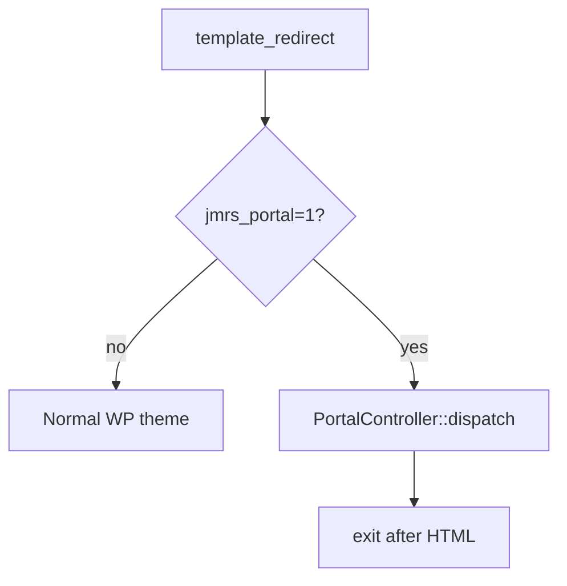

# Portal Architecture — JM Referral System

Staff frontend portal (Phase 6.2A). Namespace: `JMReferral\Portal`.

**Default base path:** `staff-portal`  
**Rewrite version constant:** `PortalRouter::REWRITE_VERSION` (`6.2.0`)  
**Disabled by default** (`PortalSettings`).

---

## Components

| Class | Responsibility |
| --- | --- |
| `PortalSettings` | Option `jmrs_staff_portal_settings`; sanitize; flush rewrites on enable/path change |
| `PortalUrls` | Home, dashboard, referrals, referral URL helpers |
| `PortalRouter` | Rewrite rules, query vars, `template_redirect` dispatch |
| `PortalController` | Auth gates, view models, privacy headers, template render |
| `PortalAccess` | Eligibility, login/logout redirects, admin bar, optional wp-admin redirect |
| `PortalNavigation` | Capability-based nav items + role label |
| `PortalAssets` | CSS/JS + branding CSS variables on portal only |

---

## Routing

Query vars: `jmrs_portal`, `jmrs_portal_route`, `jmrs_portal_id`.

| URL | Route key |
| --- | --- |
| `/{base}/` | `dashboard` |
| `/{base}/referrals/` | `referrals` |
| `/{base}/referrals/{id}/` | `referral` |

Registered on `init` only when portal **enabled**. Flush on activation/deactivation and settings path/enable change — **not** every request.



Theme header/footer are not used; controller prints a full HTML document via `templates/portal/layout.php` and calls `wp_head` / `wp_footer` for enqueued assets/hooks.

---

## Authentication

- Requires logged-in WP user.
- Unauthenticated → `wp_login_url(redirect_to current URL)`.
- Login filter: JM staff → portal dashboard (or custom login redirect URL) unless `redirect_to` is already a portal URL; WP Administrators keep normal redirect unless portal URL requested.
- Logout → `home_url('/')`.

---

## Authorization

1. `PortalAccess::current_user_can_access_portal()` (entry caps or `manage_options`).  
2. Per-route capability (`VIEW_DASHBOARD`, `VIEW_REFERRALS`).  
3. Record routes: `AccessPolicy::can_view_referral`; miss/deny → generic **404**.  
4. No portal entry → branded **403**.

Navigation hides unimplemented items (Phase 6.2A: Dashboard + Referrals / My Referrals only).

---

## Security headers

On portal responses:

- `Cache-Control: private, no-store, no-cache, must-revalidate`
- `Pragma: no-cache`
- `Expires: 0`
- `X-Content-Type-Options: nosniff`
- plus `nocache_headers()`

---

## Templates

```
templates/portal/
  layout.php
  dashboard.php
  referrals/list.php
  referrals/view.php
  errors/403.php
  errors/404.php
```

Templates receive prepared `$view` arrays (no SQL). Layout provides sidebar, top bar, breadcrumbs, alert indicator, logout.

---

## Assets

`assets/css/portal.css`, `assets/js/portal.js` — mobile drawer, skip link support. Scoped under `.jmrs-portal`. Branding colours via inline CSS variables from settings.

---

## wp-admin restriction

When `redirect_wp_admin` is enabled (default **off**):

- Non-administrator JM portal users redirected from ordinary wp-admin screens to portal dashboard.
- Allowed: AJAX, `admin-post.php`, `async-upload.php`, document download/export/migration query args, profile screens, cron.
- Admin bar hidden for those staff on the frontend; WP Administrators unaffected.

---

## Read-only scope (v1.0)

Portal does **not** implement:

- Edit, notes, uploads, stage changes  
- Care-plan editing, scheduling, visit execution, MAR  
- Reports pages  

Downloads reuse admin secure download URLs.

---

## Future expansion

Add rewrite rules + `PortalController` match arms + templates; keep calling existing services. Candidate v1.1: edit, notes, visits, MAR, reports. See `ROADMAP.md`.

---

## Related

- `docs/STAFF_PORTAL.md` (ops)
- `docs/STAFF_USER_GUIDE.md`
- [`PERMISSIONS.md`](PERMISSIONS.md)
- [`DEPENDENCY_INJECTION.md`](DEPENDENCY_INJECTION.md)
