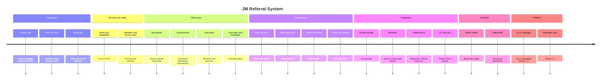

# Project History — JM Referral System

Historical timeline of major milestones culminating in **Version 1.0.0**. Dates are approximate relative to phased delivery documented in `CHANGELOG.md` / `ROADMAP.md`.

---

## Timeline

---

## Milestone notes

| Milestone | What landed |
| --- | --- |
| **Project start** | `jm-referral-system.php`, Composer autoload `JMReferral\` → `src/`, Activator/Deactivator, Migrator |
| **Referral CRUD** | Repository/service/controller, numbering, list filters, notes, activity, CSV, email notifications |
| **Assessments** | `jmrs_referral_assessments`, assessment service/controller on Referral View |
| **Care plans** | Plans, reviews, versions; generate-from-assessment |
| **Scheduling** | Visit schedules + generation with `generation_key` idempotency |
| **Visits** | Manual + generated visits; execution/review; visit tasks |
| **Medication** | Medication list + visit administrations (MAR foundation) |
| **Reports** | Report service/controllers, alerts integration, exports |
| **Performance optimisation** | List/view pagination, bulk enrichment, generation batching, indexes (`2.16.0`), chunked CSV |
| **Security hardening** | Private documents (`2.14.0`), template resolver, CSV formula escape, AccessPolicy mutate rules |
| **Staff Portal** | Phase 6.2A — routing, shell, dashboard, referral list/view, optional wp-admin redirect |
| **Public Referral Wizard** | Phase 6.1A/B — shortcode, spam controls, private uploads, multi-step UX (`2.17.0`) |
| **Release engineering** | Phase 7.1 — guides, LICENSE/SECURITY/CONTRIBUTING, packaging, checklist |
| **Version 1.0.0** | First production package (product `1.0.0`, schema `2.17.0`) |
| **Developer documentation** | Phase 7.2 — this `docs/developer/` set |

---

## Next roadmap — Version 1.1

Planned product line (see root `ROADMAP.md`):

- Portal **editing**
- Portal **notes**
- Portal **visits** (execution)
- Portal **MAR**
- Portal **reports**
- Hardening backlog: performance/Menu DI, Chart.js local pin, legacy media cleanup, automated tests, optional public CAPTCHA, timed retention purge (legal-gated)

---

## Related

- Root `CHANGELOG.md`, `ROADMAP.md`
- `docs/RELEASE_NOTES_v1.0.0.md`
- [`ARCHITECTURE.md`](ARCHITECTURE.md)
