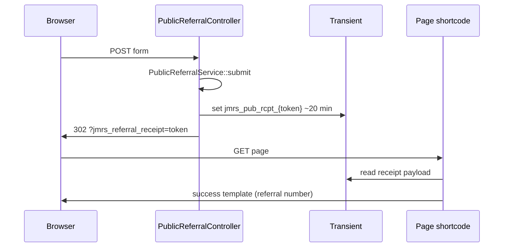

# Public Referral Architecture — JM Referral System

Namespace: `JMReferral\Frontend` (+ shared `ReferralService` / documents / notifications).

**Shortcode:** `[jmrs_public_referral_form]`  
**Channel:** `SubmissionChannels::PUBLIC_WEBSITE` (`public_website`)  
**Settings option:** `jmrs_public_referral_settings`  
**Disabled by default.**

---

## Components

| Class | Role |
| --- | --- |
| `PublicReferralSettings` | Enable flag, privacy URL, consent version, emails, branding, upload limits |
| `PublicBranding` | Resolved branding for templates |
| `PublicReferralService` | Validate, spam checks, create via `ReferralService`, uploads, notify |
| `PublicReferralController` | POST handler on `template_redirect`; PRG redirects |
| `PublicReferralShortcode` | Render form/success; enqueue CSS/JS |
| `SubmissionChannels` / `ReferrerTypes` | Labels and channel helpers |

Templates: `templates/frontend/public-referral-form.php`, `public-referral-success.php`.  
Assets: `assets/css/public-referral.css`, `assets/js/public-referral.js`.

---

## Wizard & progressive enhancement

JavaScript presents steps (Welcome → About You → Person → Care Needs → Documents → Review) by toggling visibility. **One native HTML POST** submits the full form.

Without JS, the complete form remains usable. Submit-button handling preserves the submitter and defers disable so the browser POST is not cancelled (same pattern as admin.js).

Optional analytics CustomEvents expose **step number only** (no PHI).

---

## Validation

`PublicReferralService` sanitizes/validates referrer, client, care needs, consent, service type (must be selectable), etc., then maps into `ReferralService::create()` input including:

- `submission_channel` = public website  
- `referral_source` = website  
- `public_consent_at` / `public_consent_version`  

Server-side validation is authoritative; client wizard is UX only.

---

## Spam protection

| Control | Behaviour |
| --- | --- |
| Nonce | `jmrs_public_referral_submit` |
| Honeypot | Field `jmrs_website` — if filled, silent fail |
| Timing | `jmrs_form_started` — reject if &lt; 3 seconds |
| Rate limit | Transient `jmrs_pub_rl_*` — 5 / hour per hashed IP+UA (no raw IP stored in options) |
| Enabled flag | Settings must enable form |

---

## Private uploads

When allowed in settings:

- `ReferralDocumentService::upload_for_public_intake`
- Stored under `uploads/jmrs-private/` only  
- Count/size limits from settings  
- Partial upload failure can be surfaced on receipt without failing the whole referral when configured by service result flags

---

## Notifications

`NotificationService`:

- Ops: public referral received (notification email from settings / fallbacks)
- Referrer: confirmation template when email present

Uses `EmailNotificationService` + templates under `src/Notifications/Templates/`.

---

## Receipt token & PRG

- Avoids duplicate create on refresh (PRG).  
- Payload: referral number (+ upload_partial flag); not full PHI dump.  
- Fallback query args exist for edge cases (`jmrs_referral_received`).  
- `nocache_headers` on receipt URLs.

---

## Security summary

- No JMRS capability required (public).  
- Does not bypass AccessPolicy for staff later viewing the referral.  
- Does not create Media Library attachments for new uploads.  
- Does not weaken spam controls when wizard JS is present.

---

## Related

- `docs/PUBLIC_REFERRAL_INTAKE.md`
- `docs/PUBLIC_REFERRAL_GUIDE.md`
- [`WORKFLOWS.md`](WORKFLOWS.md)
- [`SERVICES.md`](SERVICES.md) — `PublicReferralService`, `ReferralService`
