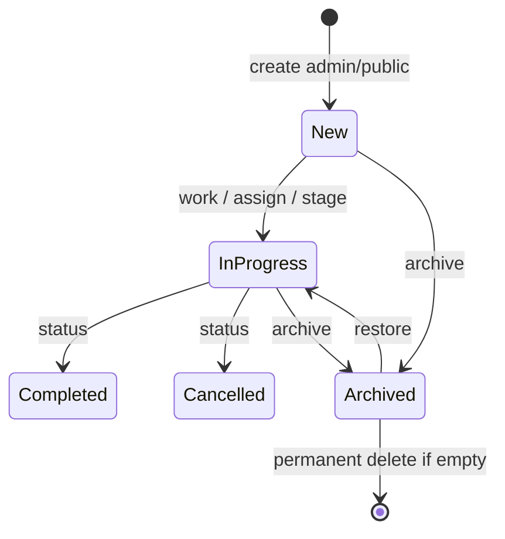
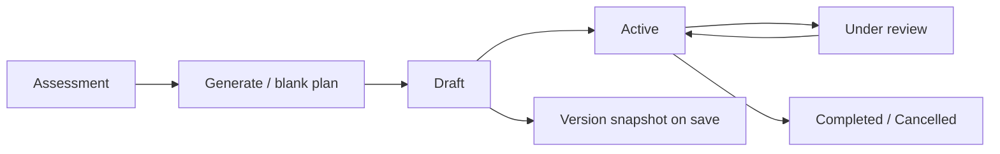
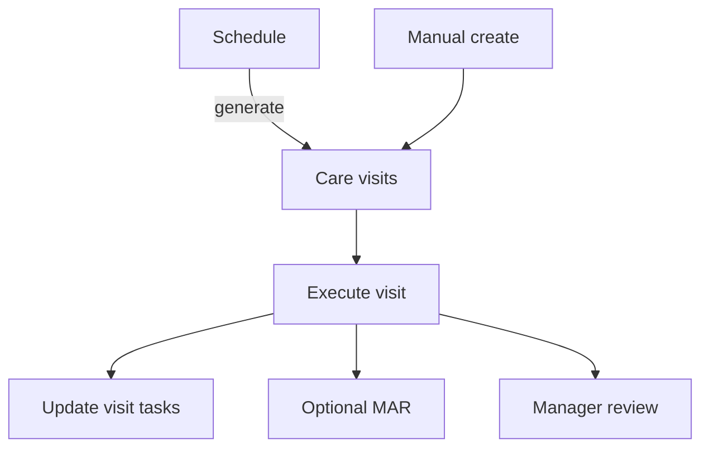
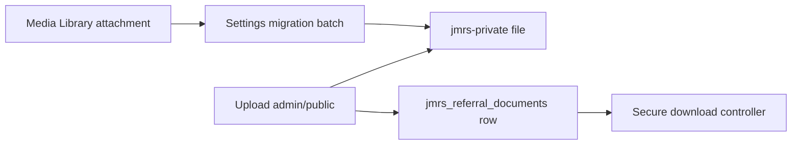

# Workflows — JM Referral System

Operational lifecycles as implemented in services/controllers. Diagrams are conceptual; enforcement is always capability + AccessPolicy where noted.

---

## Referral lifecycle

**Create:** `ReferralService::create` (admin `ReferralController` or `PublicReferralService`).  
**Update / stage:** `ReferralService::update`, `change_workflow_stage`.  
**List/export:** `ReferralRepository::query` + filters; export controller.  
**Activity:** `ReferralActivityService` logs.  
**Archive:** `ReferralRetentionService::archive` / `restore` / `permanently_delete`.

---

## Assessment lifecycle

1. Open Referral View with `EDIT_REFERRALS` + mutate.  
2. `ReferralAssessmentService::save` upserts row (`UNIQUE referral_id`).  
3. Activity logged.  
4. May unlock care-plan generation (`ReferralCarePlanService::generate_from_assessment`).

Portal: read-only display of mapped assessment fields.

---

## Care plan lifecycle

- Save/activate: `ReferralCarePlanService::save`  
- Reviews: `ReferralCarePlanReviewService::add_review`  
- Versions: stored in `jmrs_care_plan_versions`

---

## Visit lifecycle

- CRUD: `CareVisitService::save`  
- Generation: `ScheduleGenerationService::generate` (idempotent `generation_key`)  
- Execution/review: `VisitExecutionService::execute` / `review`  
- Tasks: `VisitTaskService`
- Service location (Phase 2F.1): unexecuted visits resolve dynamically via `ServiceLocationResolver`; execution freezes a denormalized snapshot onto `jmrs_care_visits` in the same UPDATE as `visit_outcome` (no rewrite on transfer/care-setting change)
- Service location UI (Phase 2F.2): portal schedules/visits/execute/review show current vs historical location; own-home address editable on referral edit; soft unresolved warnings do not block clinical workflows
- Visit reporting (Phase 2G.4): WP Admin Reports Visit filters use snapshot for executed visits and current care setting/occupancy for open visits; terminal visits without snapshot are Location Not Recorded (never current Home)

Portal: recent visits read-only.

---

## Medication lifecycle

1. Manage list: `MedicationService::save` (`medication_status`, dosage, route, …).  
2. During visit execution: `MedicationAdministrationService::save_for_visit`.  
3. Exceptions feed operational alerts / dashboard counts.

---

## Document lifecycle

- Staff upload: `ReferralDocumentService::upload`  
- Public: `upload_for_public_intake`  
- Download: `prepare_download` + controller stream  

---

## Archive lifecycle

1. User with `ARCHIVE_REFERRALS` archives → `archived_at` set; mutate blocked.  
2. Lists/alerts/dashboard default to active only.  
3. Restore clears archive fields.  
4. Permanent delete runs dependency counts; blocked if notes/docs/assessments/visits/etc. remain.

---

## Public referral lifecycle

See also [`PUBLIC_REFERRAL_ARCHITECTURE.md`](PUBLIC_REFERRAL_ARCHITECTURE.md).

1. Visitor loads page with `[jmrs_public_referral_form]`.  
2. Wizard (JS) or full form (no-JS) → single POST.  
3. Spam checks → `ReferralService::create` with `submission_channel=public_website`.  
4. Optional private uploads.  
5. Notifications (ops + confirmer).  
6. PRG redirect to receipt transient.  
7. Staff continue workflow in admin/portal.

---

## Portal lifecycle

See [`PORTAL_ARCHITECTURE.md`](PORTAL_ARCHITECTURE.md).

1. Settings enable portal → rewrite rules.  
2. User hits `/staff-portal/…` → login if needed.  
3. PortalAccess eligibility → route dispatch.  
4. Read-only views via shared services.  
5. Logout → site home.  
6. Optional wp-admin redirect for non-admin JM staff.

---

## Care team & schedule (summary)

- **Care team:** assign users with role/primary/dates → `CareTeamService`.  
- **Schedules:** define pattern → generate visits in a window → skip existing keys.

---

## Related

- [`DATABASE_SCHEMA.md`](DATABASE_SCHEMA.md)
- [`PERMISSIONS.md`](PERMISSIONS.md)
- [`SERVICES.md`](SERVICES.md)
