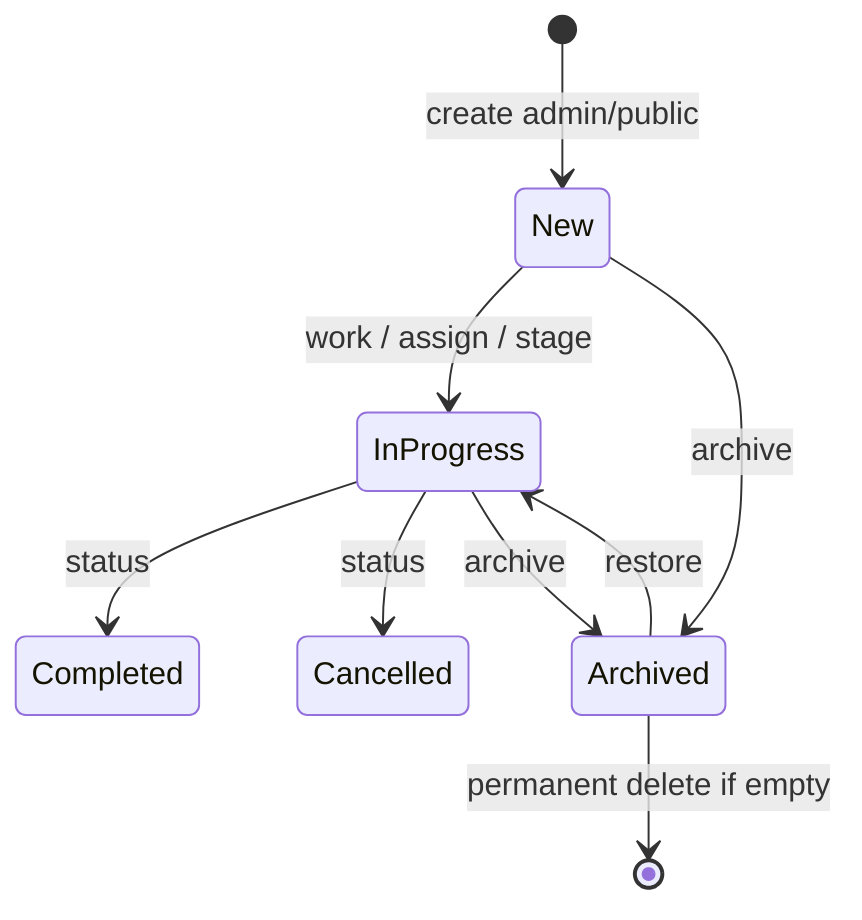
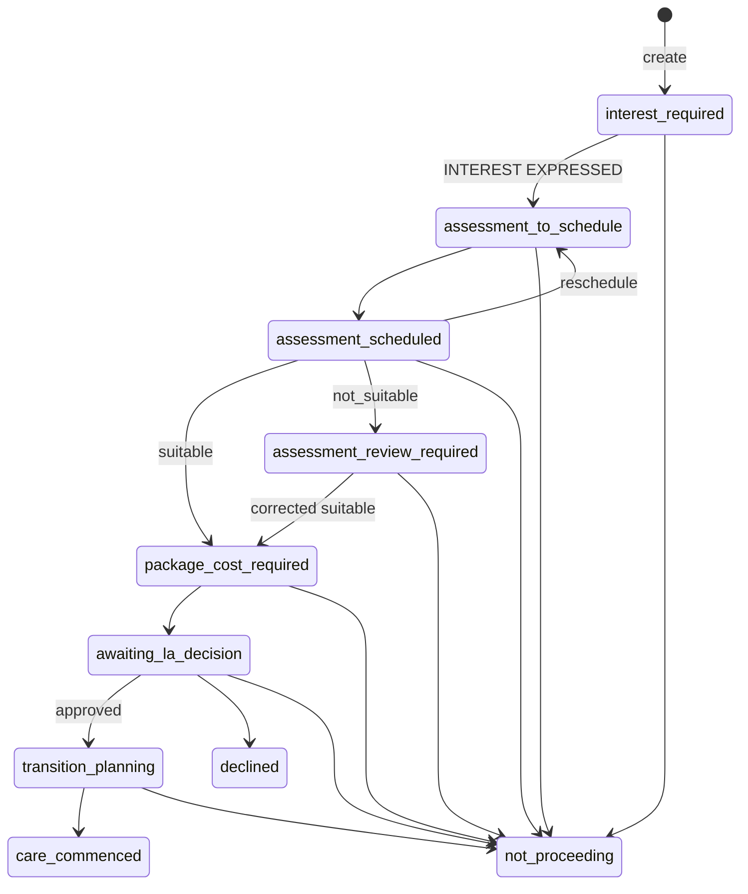
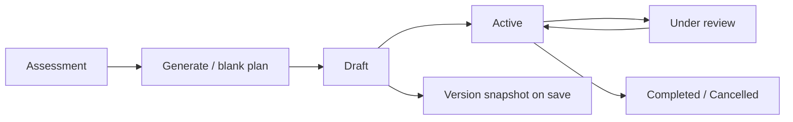
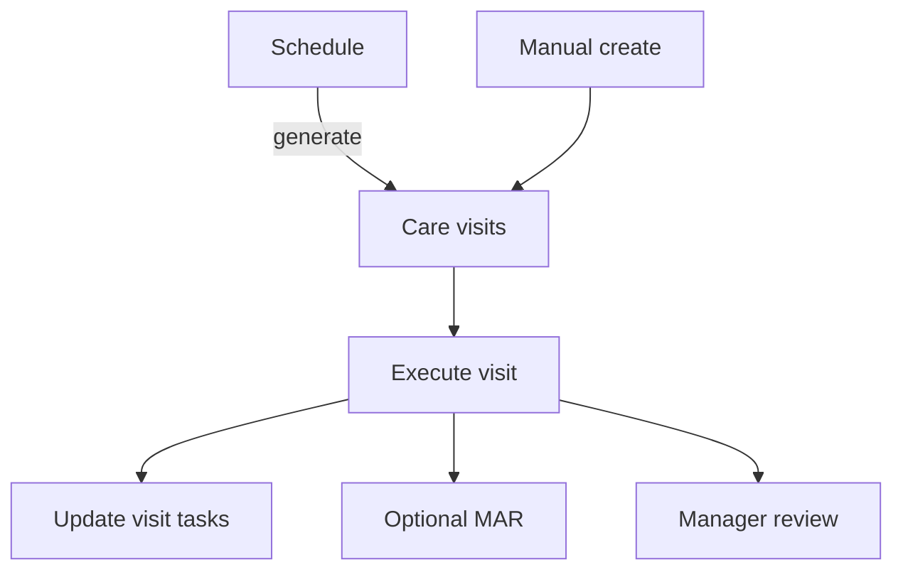
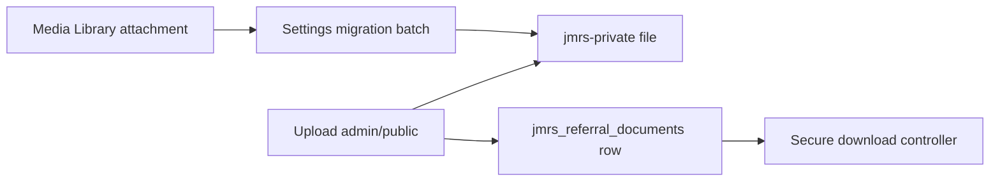

# Workflows — JM Referral System

Operational lifecycles as implemented in services/controllers. Diagrams are conceptual; enforcement is always capability + AccessPolicy where noted.

---

## Referral lifecycle

**Create:** `ReferralService::create` (admin `ReferralController` or `PublicReferralService`).
**Update / legacy stage:** `ReferralService::update`, `change_workflow_stage` (legacy stages only).
**Pipeline:** `ReferralPipelineService` (canonical transitions + override).
**List/export:** `ReferralRepository::query` + filters (incl. pipeline stage); export controller.
**Activity:** `ReferralActivityService` logs (`pipeline_started`, `pipeline_stage_changed`, `pipeline_stage_overridden`, `interest_expressed`, `interest_email_failed`).
**Archive:** `ReferralRetentionService::archive` / `restore` / `permanently_delete`.

---

## Acquisition pipeline (Phase 3B)

**Status vs pipeline**

| Field | Role |
| --- | --- |
| `jmrs_referrals.status` | Broad lifecycle: `new` / `in_progress` / `completed` / `cancelled` (unchanged) |
| `jmrs_referrals.workflow_stage_id` | Acquisition pipeline pointer into `jmrs_workflow_stages` |

Canonical stages live in `JMReferral\Pipeline\PipelineStage` and are stored as system pipeline rows (`is_system`, `is_pipeline_stage`).

**Canonical stages (what needs to happen next):**
`interest_required` → `assessment_to_schedule` → `assessment_scheduled` → (`assessment_review_required` when not suitable) → `package_cost_required` → `awaiting_la_decision` → `transition_planning` → `care_commenced`

Branch exits: `not_proceeding` / `declined` (from allowed nodes). Terminal: `care_commenced`, `declined`, `not_proceeding`.

Milestones such as interest expressed / assessment completed / package cost sent / approved are **events**, not sticky stages (enforced by later business-action phases).

**Normal transitions:** `ReferralPipelineService::transition` (used by business actions such as Express Interest).
**Override:** `jmrs_override_pipeline_stage` (JM Administrator + Referral Manager only); requires reason; `change_type=override`; history + activity always written.

**New referrals:** default to `interest_required`, set `workflow_stage_entered_at`, write history `change_type=created`.
**Legacy referrals:** keep existing stage; no backfill of `workflow_stage_entered_at` or fake history; UI shows “Legacy workflow stage”.

**Next action:** derived from `PipelineStage::next_action($slug)` — not stored on the referral.

---

## Express Interest (Phase 3C)

Business event **INTEREST EXPRESSED** — not a workflow stage. After a successful response the current stage is **Assessment to Schedule** (next action: Schedule assessment).

**Service:** `JMReferral\Pipeline\InterestResponseService`

**UI:** Express Interest panel on portal/admin referral view only when stage = `interest_required` and interest not yet recorded.

**Methods**

| Method | Behaviour |
| --- | --- |
| `email` | Sends allowlisted template `interest-expressed` via existing `NotificationService` / SMTP to `referrer_email`. Success = mailer accepted for sending (**Sent**, not Delivered). |
| `phone` | No email. Requires explicit confirmation checkbox. Recipient snapshot = `referrer_phone` when present. |
| `other` | No email. Requires confirmation. Optional short operational note (≤190 chars), non-clinical. |

**Permissions:** `AccessPolicy::can_express_interest` — JM Administrator, Referral Manager, Care Coordinator (and WP admin). Assessor and Support Worker denied. Uses mutate permission; does **not** require pipeline override capability.

**Ordering / failure safety**

1. Validate referral, stage, method, permissions, contact data.
2. If email: attempt send **outside** any DB transaction.
3. On mailer failure: do **not** set interest columns; do **not** advance pipeline; log `interest_email_failed`; allow retry.
4. On mailer accept (or phone/other confirmed): open TX → write interest milestone → `ReferralPipelineService::transition(interest_required → assessment_to_schedule)` (shared TX, no nested mail) → COMMIT → activity `interest_expressed` + stage change activity.

**Edge case (accepted):** mailer accepts the message but a later DB write fails — rare; no outbox in 3C. Structure allows a future outbox without changing the UI contract.

**Duplicate protection:** `interest_expressed_at` already set, or stage ≠ `interest_required` → informational error; nonce + server checks; no duplicate history from double-submit.

**Public form:** unchanged. Submission still creates `interest_required` and notifies JM staff only. Interest email is never auto-sent on public submit.

---

## Assessment scheduling (Phase 3D)

Pipeline progression for appointments:

`assessment_to_schedule` → (Schedule Assessment) → `assessment_scheduled` → (suitable / suitable_with_conditions) → `package_cost_required`

`assessment_scheduled` → (`not_suitable`) → `assessment_review_required` → (Mark Not Proceeding) → `not_proceeding`

Correction while still on review: `assessment_review_required` → (suitable / suitable_with_conditions) → `package_cost_required`

**Assessment Completed** is an event/milestone, not a sticky pipeline stage.

**Service:** `JMReferral\Assessment\AssessmentSchedulingService`

**Clinical save:** `ReferralAssessmentService::save` (unchanged form; preserves scheduling columns)

| Action | Stage rule | Pipeline effect |
| --- | --- | --- |
| Schedule Assessment | `assessment_to_schedule` | → `assessment_scheduled` (once) |
| Reschedule Assessment | `assessment_scheduled` | none (stage entered time unchanged) |
| Mark as Needs Rescheduling | `assessment_scheduled` | → `assessment_to_schedule` (reason in stage history) |
| Clinical outcome leaves `pending` as suitable / suitable_with_conditions | `assessment_scheduled` or `assessment_review_required` | → `package_cost_required` (once) |
| Clinical outcome = `not_suitable` | `assessment_scheduled` | → `assessment_review_required` (status unchanged) |
| Mark as Not Proceeding | `assessment_review_required` | → `not_proceeding`; status → `cancelled` |
| Edit completed assessment back to `pending` while on review | `assessment_review_required` | **no** automatic rewind; override/repair if needed |

**Assessor vs pipeline owner:** `assessment.assessor_user_id` is the appointment assessor. `referrals.assigned_to` remains pipeline owner and is **not** overwritten by scheduling.

**Completion semantics:** `is_completed_assessment()` = outcome ∈ {suitable, suitable_with_conditions, not_suitable}. Saving with outcome=`pending` does **not** advance the pipeline. Re-saving an already-completed assessment does not duplicate history/transitions.

**Phase 4E.1 terminal policy:** Once outcome is non-pending, clinical fields and scheduling become **read-only** in service/controller and UI. No reopen/correction workflow. No separate Cancel Appointment (Needs Rescheduling remains for pending scheduled appointments only). No assessment emails. Assessor assignment grants no access. Dashboard Operations metrics are **derived** from `scheduled_at` + `outcome` (no status column). Product **1.4.0** · DB **2.29.0** · rewrite **1.2.7**. Focused UAT **PASS** 2026-08-27 (not-suitable second-referral and admin completed-view **NOT RUN — CODE REVIEWED**).

---

## Referral meetings & responsibilities (Phase 4B.1 data foundation)

**Schema:** DB `2.29.0` — `jmrs_referral_meetings`, `jmrs_referral_meeting_attendees`, plus `champion_user_id` / `transition_lead_user_id` on referrals.

**Services:** `ReferralMeetingService`, `MeetingAttendeeService`, `ReferralResponsibilityService`, `ReferralMeetingReadService`.

**Portal UI (4B.2.1–4B.2.5):** Nested routes under `/referrals/{id}/meetings/` (`PortalRouter` rewrite **1.2.6**). View via `can_view_referral_meetings`; contacts via `can_view_referral_meeting_contacts`; mutations via `can_manage_referral_meetings` + `MeetingLifecyclePolicy`. Write routes: new / edit / schedule / complete / cancel. **Internal attendees (4B.2.3, UAT PASS 2026-08-27).** **External participants (4B.2.4 PARTIAL MANUAL UAT ACCEPTED; Batch 4 residual risk preserved).** Soft completion warning counts all non-final attendees (internal + external). **4B.2.5 focused UAT PASS 2026-08-27:** sticky correction identity, reschedule no-op, `meeting_scheduled` taxonomy, a11y/responsive polish — Product **1.4.0** · DB **2.29.0** · rewrite **1.2.6**; no new routes/schema; no emails; no attendee-based access; no workflow-stage changes. Meetings remain separate from assessment scheduling.

**Critical:** Meetings are **independent** of formal assessment appointments and **must not** create, advance, or reverse canonical pipeline stages. `assessment_to_schedule` / Visual Stage 2 (“Appointment to Arrange”) are unchanged. Creating, completing, or cancelling a meeting does not write stage history.

**Owner vs responsibilities (4C.1):** `assigned_to` is the **Referral owner**. Champion and transition lead are optional. Staff Portal Responsibilities panel + `/referrals/{id}/responsibilities/` (rewrite **1.2.7**; focused UAT **PASS** 2026-08-27). Eligibility: `UserProvider::is_assignable`. Manage via `can_assign_referral_responsibilities`. Champion / transition lead do **not** grant AccessPolicy visibility or portal access. Same person may hold multiple roles. No-op saves create no activity. Owner changes via this form do **not** send assignment emails. Archived = read-only. No schema migration.

**Activity (meetings):** `meeting_created`, `meeting_updated`, `meeting_scheduled`, `meeting_rescheduled`, `meeting_completed`, `meeting_cancelled`, `meeting_attendee_*`, `champion_*`, `transition_lead_*` — data-minimised (no external email/phone/URL in descriptions). No-op reschedule/detail/attendee updates do not log. Owner changes reuse `assigned` / `reassigned`.

**Permissions:** `AccessPolicy::can_manage_referral_meetings` / `can_assign_referral_responsibilities` (same allow/deny as Express Interest for mutations). Contact read: `can_view_referral_meeting_contacts`. Assessor and Support Worker denied management; Assessor denied contacts; Support Worker denied meeting view. No emails from these services.

**Migration:** No meeting/attendee/champion/transition-lead backfill. Empty tables and NULL columns after upgrade until staff assign them.

---

## Assessment lifecycle

1. Schedule appointment when stage is `assessment_to_schedule` (creates/updates assessment row scheduling fields).
2. Open clinical Assessment UI with `EDIT_REFERRALS` + mutate.
3. `ReferralAssessmentService::save` upserts clinical fields (`UNIQUE referral_id`); preserves scheduling columns.
4. On first suitable / suitable_with_conditions completion while `assessment_scheduled` (or correction while `assessment_review_required`), pipeline advances to `package_cost_required`. `not_suitable` advances to `assessment_review_required` without cancelling the referral.
5. May unlock care-plan generation (`ReferralCarePlanService::generate_from_assessment`) when a row exists.

Portal: schedule panel on referral view; clinical create/edit on assessment route.

---

## Package Cost (Phase 3E / 3E.1 / **4F.1**)

Business milestones **Package Cost Prepared** and **Package Cost Sent** — not pipeline stages.

Canonical stage transition on successful submission only:

`package_cost_required` → `awaiting_la_decision`

**Service:** `JMReferral\PackageCost\PackageCostService`

**Table:** `jmrs_referral_package_costs` (schema unchanged through 4F.1; Product **1.4.0** · DB **2.29.0** · rewrite **1.2.7**)

**Document:** reuses `ReferralDocumentService` / private storage (PDF/DOC/DOCX). No separate file store. Attachments for email are resolved server-side from the Package Cost’s current `document_id` only — never from request-supplied paths or public URLs. Linked documents must belong to the same referral.

| Action | Effect |
| --- | --- |
| Prepare / update | Upload/replace document, optional GBP total; status=`prepared`; **no** email; **no** pipeline change. Identical re-submit is a no-op (no `updated_at` bump, no `package_cost_updated`). |
| Email send | JMRS sends via `NotificationService::notify_package_cost_sent` with private attachment; on mailer accept → status=`sent`, `send_method=email`, recipient snapshot; transition via `ReferralPipelineService`. Email body does **not** include package total. |
| Secure Portal / Other | External submission + confirmation checkbox; status=`sent`; transition (no `wp_mail` / `EmailNotificationService` call) |

**Send methods:**

- **Email** — automated by JMRS. Requires valid `referrer_email`. Button: “Send Package Cost by Email”. UI Email Status “Sent” means `wp_mail` accepted the message, not delivery proof.
- **Secure Portal / Other** — record-only after staff confirmation.

**Terminal policy (4F.1):** `status=sent` is read-only through normal portal/admin workflows. Service and handlers deny edits to total, document, currency, actors, send metadata, and status. UI shows a Sent/read-only notice and hides prepare/send forms. No reopen, withdraw, or revision workflow.

**Amount model:** Optional manual `package_total` DECIMAL(12,2); currency forced to **GBP**; blank allowed; zero allowed; negatives / excess precision / scientific notation / markup rejected; stored as normalised decimal string (no float arithmetic for persistence).

**Failure:** mailer failure or unreadable attachment leaves Package Cost `prepared` and pipeline `package_cost_required`. Activity `package_cost_email_failed`. Retry allowed. Failed email is **not** marked sent.

**Duplicate-send mitigation:** option lock (`add_option`) around the email path; re-check `status=prepared` before SMTP; conditional SQL claim `WHERE status=prepared` before transition. Ordinary double-submit / refresh does not double-advance. Rare concurrent SMTP race remains possible without a full outbox.

**Mail-then-DB edge case:** SMTP accept cannot join the DB transaction. If persistence fails after accept, Package Cost may remain `prepared` while the email was already handed to the mailer — no outbox/reconciliation.

**Next action (derived):** not prepared → Prepare package cost; prepared → Send package cost to Local Authority; `awaiting_la_decision` → Await/follow up Local Authority decision.

**Permissions:** `AccessPolicy::can_manage_package_cost` (same commercial roles as Express Interest). Preparing also requires `jmrs_upload_documents`. Assessor may **view** package panel amounts when the referral is visible (**EXISTING PRODUCT BEHAVIOUR — REQUIRES FUTURE JM CONFIRMATION**). Support Worker denied. Owner / Champion / Transition lead membership grants no package permission. Archived referrals remain read-only. Override cap not required.

**Operations dashboard (4F.1):** Package Costing section — package cost required / prepared / sent / awaiting LA decision counts (latest package row by `MAX(id)`; non-archived; scoped). Lists show referral number, status, prepared/sent date only — **no** totals, recipients, references, or filenames. Commercial PPV KPI on the board remains unchanged. Conversion / revenue metrics remain deferred. Focused UAT **PASS** 2026-08-27 (email send **NOT RUN — CODE REVIEWED**). Product **1.4.0** · DB **2.29.0** · rewrite **1.2.7**.

**Deferred:** structured costing calculator, VAT, multi-currency UI, auto PDF generation, delivery/read tracking, mail outbox, revision/withdrawal workflow, Assessor amount-visibility product decision.

---

## Local Authority Decision (Phase 3F)

Business milestone — not a sticky “approved” pipeline stage.

| Outcome | Pipeline transition | Broad `referral.status` |
| --- | --- | --- |
| Approved | `awaiting_la_decision` → `transition_planning` | → `in_progress` (via `ReferralService::change_lifecycle_status`) |
| Declined | → `declined` (terminal) | → `cancelled` |
| Not Proceeding | → `not_proceeding` (terminal) | → `cancelled` |

**Service:** `JMReferral\LaDecision\LocalAuthorityDecisionService`
**Table:** `jmrs_referral_la_decisions` (DB `2.26.0`)

**Requirements:** stage = `awaiting_la_decision`; current Package Cost `status=sent`; commercial permission `can_record_la_decision`.

**Funding (Approved only):** Yes / No / Not Recorded. Missing funding reference does **not** block transition planning. Approval ≠ automatic funding confirmation.

**Immutability:** Normal workflow is record-once / read-only. No casual edit UI. Correction = Manager/Admin pipeline override / controlled repair (deferred full reconsideration).

**Activity:** `la_decision_approved` / `la_decision_declined` / `referral_not_proceeding` (no notes/funding refs in timeline). Plus pipeline history + status_changed when status changes.

**Notifications:** No LA acknowledgement email. Assignees may receive existing `status-changed` email when broad status updates (same pathway as edit form).

**Permissions:** Same commercial gate as Express Interest / Package Cost (Admin / Manager / Coordinator). Assessor / Support Worker denied. Override not required for normal recording.

---

## Mark as Not Proceeding (Phase 3F.1)

Generic acquisition closure (not the LA Decision form).

**Service:** `JMReferral\Pipeline\ReferralNonProceedingService`
**Reasons:** `JMReferral\Pipeline\NonProceedingReason` (canonical codes stored in `jmrs_referral_stage_history.reason`)

**Allowed source stages:** `interest_required`, `assessment_to_schedule`, `assessment_scheduled`, `assessment_review_required`, `package_cost_required`, `transition_planning`

**Not available on:** `awaiting_la_decision` (use Phase 3F LA Decision → Not Proceeding so `jmrs_referral_la_decisions` is recorded), terminal stages, legacy stages.

**Effect:** pipeline → `not_proceeding`; `referral.status` → `cancelled` via `ReferralService::change_lifecycle_status`; activity `referral_not_proceeding`. Prepared Package Cost / appointments / documents are retained (not emailed, not marked sent).

**Permissions:** `AccessPolicy::can_mark_not_proceeding` (same commercial gate). Assessor cannot close acquisition.

### Assessment Outcome Review (`assessment_review_required`)

Canonical stage meaning **what JM needs to do next** after a completed `not_suitable` assessment.

- Clinical completion (`assessment_completed` event) is separate from commercial closure.
- `not_suitable` does **not** set `cancelled` or auto Mark Not Proceeding.
- Admin / Manager / Coordinator decide Not Proceeding from this stage (suggested reason `jm_not_suitable`).
- Correction to `suitable` / `suitable_with_conditions` while still on review → `package_cost_required` once.
- Editing back to `pending` does **not** rewind the pipeline.

---

## Transition Planning & Care Commencement (Phase 3G)

Acquisition terminal success — explicit staff confirmation, not inferred from occupancy/visits/schedules.

**Services:** `JMReferral\Transition\TransitionPlanningService` (readiness context), `JMReferral\Transition\CareCommencementService` (mutation)

**Milestone columns (DB `2.28.0`):** `jmrs_referrals.care_commenced_at`, `care_commenced_by` — actual recorded commencement. Distinct from `care_start_date` (preferred/requested intake date on the referral form). No backfill from occupancy/visits/`care_start_date`.

**Pipeline:** `transition_planning` → `care_commenced` via `ReferralPipelineService::transition` only.

**Hard requirements:** stage = `transition_planning`; referral mutable; status not `completed`/`cancelled`; approved LA decision row; `care_setting` = `supported_living` or `own_home`; SL requires active occupancy; Own Home must not have active SL occupancy; commencement datetime not future; SL commencement date ≥ occupancy `move_in_date`.

**Soft warnings only (do not hard-block):** funding not confirmed / not recorded (requires explicit checkbox ack to continue); care plan not active; care team missing; no active schedule; incomplete Own Home address.

**Explicit rule:** Creating occupancy, schedules, care plans, or executing Own-Home visits does **not** advance the pipeline. Staff must use **Confirm Care Commenced**.

**Status:** Remains / corrects to `in_progress`. Does **not** set `completed`. Acquisition complete ≠ care record closed.

**No automatic rewind:** Ending occupancy, address changes, transfers, schedule/care-plan edits after commencement do not return the pipeline to `transition_planning`.

**Not Proceeding:** Still available on `transition_planning`. Not offered after `care_commenced` (future discharge is care lifecycle, not acquisition NP).

**Activity:** `care_commenced` — “Care commencement recorded.” plus pipeline stage-change activity. No address/bedroom/funding/clinical narrative.

**Permissions:** `AccessPolicy::can_commence_care` (Admin / Manager / Coordinator). Assessor / Support Worker denied. Placement still requires `jmrs_manage_occupancies`. Override not required for normal commencement.

**UI:** Shared partial `templates/referrals/partials/transition-planning.php` on portal + WP Admin referral view.

**Deferred:** auto-commence on move-in cron, first-visit auto-commence.

---

## Acquisition reporting (Phase 3I)

Integrated into existing WP Admin **Reports** (`ReportService` / `AcquisitionReportRepository` / `ReportExportController`). Not a second reporting engine.

| Concern | Behaviour |
| --- | --- |
| Cohort | Referrals **received** (`created_at`) in the selected date range — “Referral Cohort: Received During Selected Period” |
| Milestones | Later milestones still count for that cohort |
| Canonical vs legacy | Structured Phase 3 identity = stage-history `change_type=created` into a canonical stage (not merely current `is_pipeline_stage`). Legacy overrides onto canonical stages remain Legacy for conversion metrics |
| Archived | Included in historical acquisition reporting (unlike operational dashboard) |
| Timing | Only structured timestamp pairs; median preferred; missing = Not Available |
| Stage duration | Consecutive `jmrs_referral_stage_history` transitions for active canonical stages |
| CSV | Acquisition Pipeline section export — commercial columns only; capability + nonce |
| Access | Existing `jmrs_view_reports` (Admin / Manager / Coordinator per Roles) |

Dashboard (3H) answers “what needs doing now?”; Reports (3I) answers “what happened to referrals we received?”

---

## Pipeline Dashboard & Needs Attention (Phase 3H)

Visibility-only operational surface. **No** auto emails, SMS, cron escalation, or automatic stage changes.

**Service:** `JMReferral\Pipeline\PipelineAttentionService`

**Settings:** `JMReferral\Pipeline\PipelineInternalTargets` (option `jmrs_pipeline_internal_targets`) — hours per active stage; blank/zero = disabled; **no hard-coded non-zero defaults**.

### Pipeline Overview

Active stage cards (counts + optional “need attention”): `interest_required` … `transition_planning`.
Separate outcome counts: `care_commenced`, `declined`, `not_proceeding`.
Optional legacy workflow count (non-canonical stages). Archived excluded. Cards deep-link to existing referral list filters (`jmrs_pipeline_stage`).

### Waiting time

Derived from `workflow_stage_entered_at` (site timezone). Not persisted. Missing → “Unknown / Legacy”. Never fabricate from `created_at`/`updated_at`.
Label as **Waiting X** — call **Target Exceeded** only when an internal target is configured and exceeded. Explicit past `next_action_due_at` → **Next action overdue** (genuine due date).

### Needs Attention (exceptional, not “every active referral”)

Reasons (`PipelineAttentionReason`): `unassigned`, `target_exceeded`, `next_action_overdue`, `assessment_review_required`, `care_setting_required`, `placement_required`.
Transition hard blockers only (via care setting / occupancy) — soft readiness (care plan/team/schedule/funding) stays on Transition Planning panel.
Sort: next-action overdue → target exceeded → urgent/high priority → unassigned → oldest waiting.

### Active Pipeline Queue

All active acquisition referrals with next action (including Package Cost refine + Transition Planning derive).

### Permissions

Commercial pipeline dashboard: Admin / Manager / Coordinator (`VIEW_DASHBOARD` + unrestricted referral access). Support Workers keep scoped care KPIs but **do not** see the acquisition pipeline/Needs Attention surface. Assessor has no dashboard.

### Management Dashboard operations (Phase 4D.1)

Read-only Operations tab on `/management/` via `ManagementOperationalReadService` (composed once into `ManagementPipelineBoardService`).

| Metric | Definition |
| --- | --- |
| Active referrals | Non-archived and status not `completed` / `cancelled` |
| Status cards | Stored statuses only (`new`, `in_progress`, `completed`, `cancelled` counts as applicable); archived excluded |
| Workflow stages | `WorkflowStageService::get_pipeline_counts` — non-archived with `workflow_stage_id`; canonical stage order |
| Unassigned responsibilities | Separate counts for empty `assigned_to`, `champion_user_id`, `transition_lead_user_id` on active operational referrals |
| Workloads | Grouped by owner / champion / transition lead; display names only; Unassigned row; not performance scores |
| Upcoming meetings | Status `scheduled`, `scheduled_at` in next **14 days** (site timezone), non-archived referral |
| Past scheduled meetings | Status still `scheduled`, `scheduled_at` earlier than now — labelled past scheduled, not missed/failed |
| Recent referrals | Latest 8 non-archived by create order |
| Recent activity | Latest 10 activity rows joined to non-archived referrals; data-minimised descriptions |
| Assessment KPI | Derived Operations metrics (Phase **4E.1**): scheduled / past scheduled / completed + outcome distribution from `scheduled_at` + `outcome`; archived excluded; no narrative/contacts |
| Stale inactivity rule | **Omitted** — no approved threshold |

No package-costing conversion, authority SLA, placement conversion, revenue, or fabricated targets. No mutations/emails on dashboard GET. Meeting contact PII and online URLs excluded. Responsibility workload is **not** a performance score. Product **1.4.0** · DB **2.29.0** · rewrite **1.2.7**. Focused UAT **PASS** 2026-08-27.

### `next_action_due_at`

Still unused by normal transitions (always null on stage change). Honoured when manually/present and past for overdue attention. Not repurposed as stage-target storage.

---

## Care plan lifecycle

- Save/activate: `ReferralCarePlanService::save`  
- Reviews: `ReferralCarePlanReviewService::add_review`  
- Versions: stored in `jmrs_care_plan_versions`

---

## Visit lifecycle

- CRUD: `CareVisitService::save`  
- Generation: `ScheduleGenerationService::generate` (idempotent `generation_key`)  
- Execution/review: `VisitExecutionService::execute` / `review`  
- Tasks: `VisitTaskService`
- Service location (Phase 2F.1): unexecuted visits resolve dynamically via `ServiceLocationResolver`; execution freezes a denormalized snapshot onto `jmrs_care_visits` in the same UPDATE as `visit_outcome` (no rewrite on transfer/care-setting change)
- Service location UI (Phase 2F.2): portal schedules/visits/execute/review show current vs historical location; own-home address editable on referral edit; soft unresolved warnings do not block clinical workflows
- Visit reporting (Phase 2G.4): WP Admin Reports Visit filters use snapshot for executed visits and current care setting/occupancy for open visits; terminal visits without snapshot are Location Not Recorded (never current Home)

Portal: recent visits read-only.

---

## Medication lifecycle

1. Manage list: `MedicationService::save` (`medication_status`, dosage, route, …).  
2. During visit execution: `MedicationAdministrationService::save_for_visit`.  
3. Exceptions feed operational alerts / dashboard counts.

---

## Document lifecycle

- Staff upload: `ReferralDocumentService::upload`  
- Public: `upload_for_public_intake`  
- Download: `prepare_download` + controller stream  

---

## Archive lifecycle

1. User with `ARCHIVE_REFERRALS` archives → `archived_at` set; mutate blocked.  
2. Lists/alerts/dashboard default to active only.  
3. Restore clears archive fields.  
4. Permanent delete runs dependency counts; blocked if notes/docs/assessments/visits/etc. remain.

---

## Public referral lifecycle

See also [`PUBLIC_REFERRAL_ARCHITECTURE.md`](PUBLIC_REFERRAL_ARCHITECTURE.md).

1. Visitor loads page with `[jmrs_public_referral_form]`.  
2. Wizard (JS) or full form (no-JS) → single POST.  
3. Spam checks → `ReferralService::create` with `submission_channel=public_website`.  
4. Optional private uploads.  
5. Notifications (ops + confirmer).  
6. PRG redirect to receipt transient.  
7. Staff continue workflow in admin/portal.

---

## Portal lifecycle

See [`PORTAL_ARCHITECTURE.md`](PORTAL_ARCHITECTURE.md).

1. Settings enable portal → rewrite rules.  
2. User hits `/staff-portal/…` → login if needed.  
3. PortalAccess eligibility → route dispatch.  
4. Read-only views via shared services.  
5. Logout → site home.  
6. Optional wp-admin redirect for non-admin JM staff.

---

## Care team & schedule (summary)

- **Care team:** assign users with role/primary/dates → `CareTeamService`.  
- **Schedules:** define pattern → generate visits in a window → skip existing keys.

---

## Related

- [`DATABASE_SCHEMA.md`](DATABASE_SCHEMA.md)
- [`PERMISSIONS.md`](PERMISSIONS.md)
- [`SERVICES.md`](SERVICES.md)
